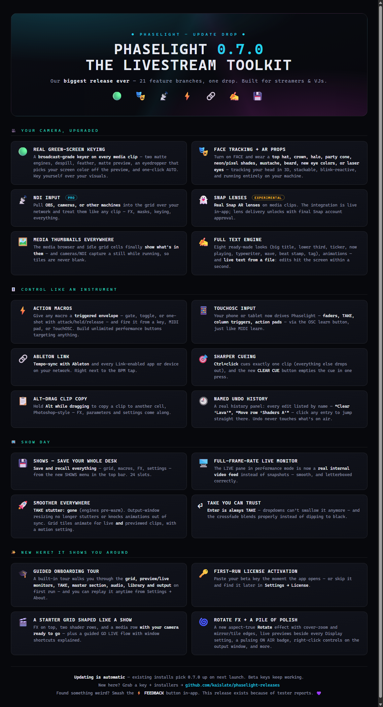
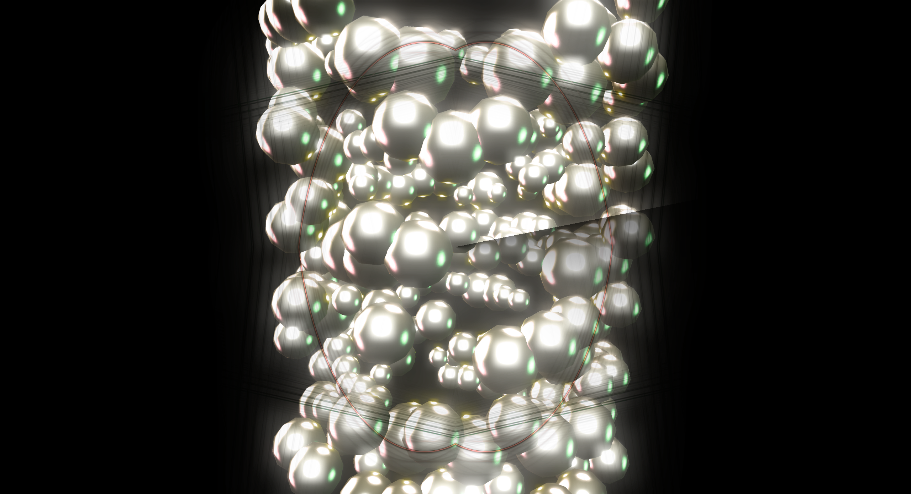
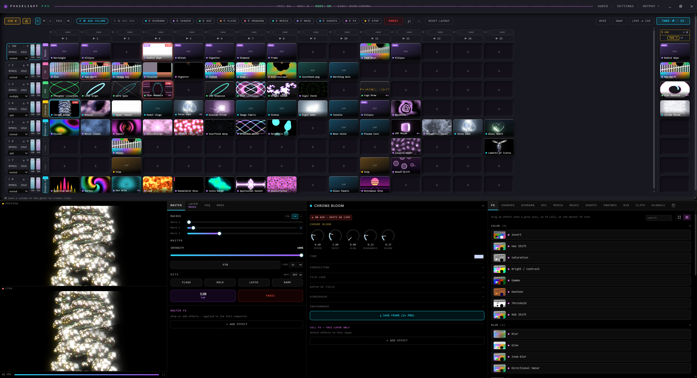

# Phaselight — Beta Releases

**A real-time VJ instrument and livestream visuals engine for Windows & macOS.** Grid-based live visuals — GPU shaders, 3D dioramas, fluid simulation, projection-style shapes, live text, and your camera — mixed on a clip grid with cue/take staging, audio reactivity, and hands-on control from MIDI, TouchOSC, or the keyboard.

**Latest: [Phaselight 0.7.1 — Smooth Takes](https://github.com/kaislate/phaselight-releases/releases/tag/v0.7.1)** — perfectly smooth crossfade TAKEs, the redesigned PROGRAM window with GO LIVE / STOP LIVE, AMD FSR / NVIDIA NIS scalers with true supersampling over NDI, resolution changes that never drop your stream, a faster engine (biggest gains on macOS), and a media library with groups, folder import, and multi-select.

*Full notes on the [v0.7.1 release page](https://github.com/kaislate/phaselight-releases/releases/tag/v0.7.1). Phaselight is pre-1.0 and under active development; this repo hosts the public beta installers.*

## Install

**Windows (Pro-capable)**
1. Download the latest `-setup.exe` (NSIS) or MSI from [Releases](https://github.com/kaislate/phaselight-releases/releases).
2. Run it and launch **Phaselight**.

**macOS (Core, Apple Silicon)**
1. Download the latest `.dmg` from [Releases](https://github.com/kaislate/phaselight-releases/releases).
2. Drag **Phaselight Core** to Applications. The build is unsigned — **right-click → Open** on first launch.

Every build from **v0.6.2** onward checks for updates on launch and installs them in-app — you only ever need to install by hand once.

## Get a beta key

Request one at **https://phaselight-beta.iamkaislate-dev.workers.dev/** — enter your email, click the confirmation link, and paste the key into the prompt on first launch (or anytime in **Settings → License**). One key per person; beta keys are valid for all 0.x releases.

The app runs as **Core** out of the box on both platforms. On Windows, a beta key additionally unlocks the **Pro** outputs and inputs: NDI network video (in AND out) and the virtual camera (OBS / Zoom / Discord).

## Feedback & beta diagnostics

The fastest way to reach us is the **⚡ FEEDBACK** button at the top of the app — type your report and optionally attach a snapshot of your output and technical details. You can review exactly what gets sent before sending. You can also open an [issue](https://github.com/kaislate/phaselight-releases/issues).

During the beta the app reports lightweight anonymous usage on its periodic license check (key id, app version, OS) so we can see which builds are actually in use. No personal data, no content, nothing from your machine beyond that — and the in-app notice spells it out.

