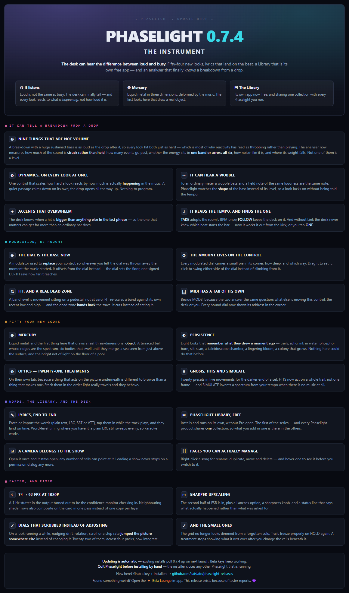
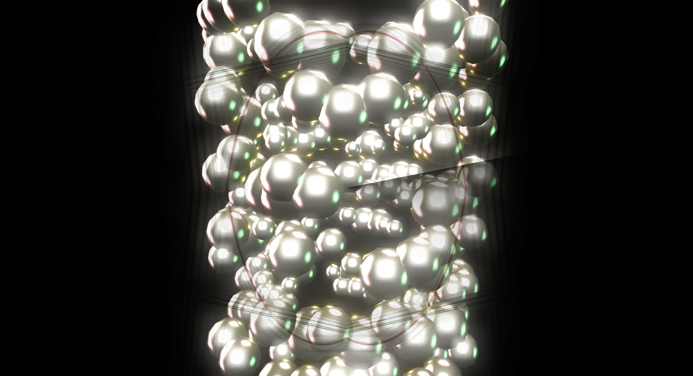
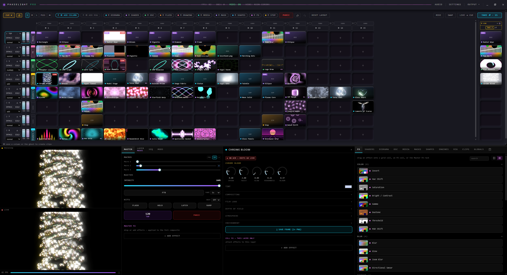

# Phaselight — Beta Releases

**A real-time VJ instrument and livestream visuals engine for Windows & macOS.** Grid-based live visuals — GPU shaders, 3D dioramas, projection-style shapes, live text, and your camera — mixed on a clip grid with cue/take staging, audio reactivity, and hands-on control from MIDI, OSC, or the keyboard. It arranges too: a full **timeline** with automation, a **page per song**, and a **media library** that manages everything you own.

**Latest: [Phaselight 0.7.4 — The Instrument](https://github.com/kaislate/phaselight-releases/releases/tag/v0.7.4)** — the desk can hear the difference between **loud** and **busy**. A breakdown with a huge sustained bass is as loud as the drop that follows it, so every look used to hit both just as hard; the analyser now measures nine things about the sound that are *not* its volume, and one **Dynamics** control scales how hard every look reacts by how much is actually happening in the music. Plus **fifty-four new looks** (Mercury's liquid metal, eight looks that remember the frame before, twenty-one lens treatments), a **lyrics system** that lands words on the beat, modulation rebuilt around the dial you already set, and **Phaselight Library** — the first standalone in the series, and free.

*Full notes on the [v0.7.4 release page](https://github.com/kaislate/phaselight-releases/releases/tag/v0.7.4). Phaselight is pre-1.0 and under active development; this repo hosts the public beta installers.*

## Install

**Windows — Phaselight Pro**
1. Download `Phaselight.Pro_<version>_x64-setup.exe` (or the `.msi`) from [Releases](https://github.com/kaislate/phaselight-releases/releases).
2. Run it and launch **Phaselight**.

**macOS — Phaselight Core (Apple Silicon)**
1. Download `Phaselight.Core_<version>_aarch64.dmg` from [Releases](https://github.com/kaislate/phaselight-releases/releases).
2. Drag **Phaselight Core** to Applications. The build is unsigned — **right-click → Open** on first launch.

**Windows — Phaselight Library (free, standalone)**
1. Download `Phaselight.Library_<version>_x64-setup.exe`.
2. It installs *alongside* Core and Pro rather than over them, and shares one collection with whichever you already have — what you add in one is there in the others.

> **Quit Phaselight before installing by hand.** The installer closes any other Phaselight that is running, without asking. If the desk is open mid-set, you lose the show. In-app updates handle this for you.

Every build from **v0.6.2** onward checks for updates on launch and installs them in-app — you only ever need to install by hand once.

## Get a beta key

Request one at the **Beta Portal** — **https://beta.phaselight.app/** — enter your email, click the confirmation link, and paste the key into the prompt on first launch (or anytime in **Settings → License**). One key per person; beta keys are valid for all 0.x releases.

The app runs as **Core** out of the box on both platforms. A beta key additionally unlocks the **Pro** tier: NDI in and out, Spout, the virtual camera, window and display capture, per-application audio, the Program window, recording, OSC input and Ableton Link. **Settings → License** shows the full comparison, marked for the machine you are on.

Content **packs** are a third thing: bought on their own, and they work in Core and Pro alike.

## Feedback & beta diagnostics

The fastest way to reach us is the **⚡ Beta Lounge** button at the top of the app — type your report and optionally attach a snapshot of your output and technical details. You can review exactly what gets sent before sending. You can also open an [issue](https://github.com/kaislate/phaselight-releases/issues).

During the beta the app reports lightweight anonymous usage on its periodic license check (key id, app version, OS) so we can see which builds are actually in use. No personal data, no content, nothing from your machine beyond that — and the in-app notice spells it out.

